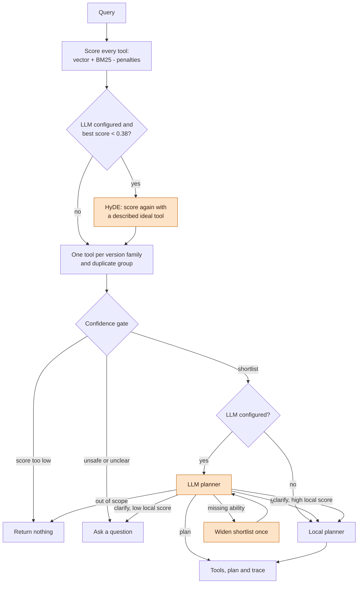

# Routing diagram

One query through the engine. Orange steps call an LLM and run only when one is configured.

```mermaid
flowchart TB
  Q[Query] --> S[Score every tool:<br/>vector + BM25 - penalties]
  S --> H{LLM configured and<br/>best score < 0.38?}
  H -->|yes| HY[HyDE: score again with<br/>a described ideal tool]:::llm
  H -->|no| D
  HY --> D[One tool per version family<br/>and duplicate group]
  D --> G{Confidence gate}
  G -->|score too low| N[Return nothing]
  G -->|unsafe or unclear| C[Ask a question]
  G -->|shortlist| P{LLM configured?}
  P -->|yes| L[LLM planner]:::llm
  P -->|no| LP[Local planner]
  L -->|failure| LP
  L -->|out of scope| N
  L -->|clarify, low local score| C
  L -->|clarify, high local score| LP
  L -->|missing ability| W[Widen shortlist once]:::llm
  W --> L
  L -->|plan| O[Tools, plan and trace]
  LP --> O
  classDef llm fill:#fde3c8,stroke:#c2660c,color:#3a1e0e
```
